## PD - Projeto da Disciplina - Engenharia de Machine Learning [25E1_3]
#### Aluna: Rosana Ribeiro Lima


## Item 1.
Link para o projeto no Github: 
https://github.com/roriblim/kobe-PD

Para rodar este projeto, foi criado um ambiente com Python na versão 3.11. Recomenda-se utilizar um ambiente com essa mesma configuração.

#### Pré-requisitos do ambiente

- Python 3.11
- pip (gerenciador de pacotes Python)

#### 1.1. Configuração do ambiente

1. Crie um ambiente virtual com Python 3.11 (recomendado):
Exemplo:
```bash
conda create --name PD_env_1 python=3.11 --no-default-packages -y
conda activate PD_env_1 # sempre que for necessário entrar na env para executar comandos no projeto!
```

2. Instale as dependências:

```bash
# dentro da env, no diretório kobe/
pip install -r requirements.txt
```

#### 1.2. Visualizando experimentos com MLflow

Para iniciar o servidor MLflow localmente, o qual será responsável por rastrear modelos e algumas métricas e parâmetros no projeto:

```bash
# dentro da env, no diretório kobe/
mlflow server --host 0.0.0.0 --port 5000
```

#### 1.3. Executando o projeto

Após iniciar o servidor MLflow localmente, para executar as pipelines Kedro (pré-processamentos, gerar as métricas, modelos e resultados, e inferências com os dados de produção), execute o projeto com:

```bash
# dentro da env, no diretório kobe/
kedro run
```

#### 1.4. Servindo o modelo gerado com MLflow

É possível subir o melhor modelo encontrado com o seguinte comando:
**Obs.: suba na porta 5002, pois é a porta chamada no Streamlit para a inferência!**

```bash
# dentro da env, no diretório kobe/
MLFLOW_TRACKING_URI=file://$PWD/mlruns mlflow models serve -m models:/best_model/latest --env-manager=local --port 5002
```

#### 1.5. Monitorando API com Streamlit (fazendo inferências)

**Após servir o modelo com MLflow**, é possível monitorá-lo via Streamlot com o seguinte comando:

```bash
# dentro da env, no diretório kobe/
cd streamlit
streamlit run main_API.py 
```

#### JupyterLab

O projeto inclui ainda suporte para JupyterLab. Para usar o JupyterLab:

```bash
# dentro da env, no diretório kobe/
kedro jupyter lab --no-browser
```

## Item 2.
#### Diagramas com as etapas do projeto:
Este projeto segue a estrutura Kedro, e também é rastreado pelo MLflow. Portanto, os artefatos são armazenados no diretório data/, e os parâmetros, métricas e artefatos monitorados pelo MLflow são armazenados em mlruns/.
Foram utilizadas três pipelines, as quais se encontram descritas nos diagramas a seguir:
- Pipeline de preparação dos dados:

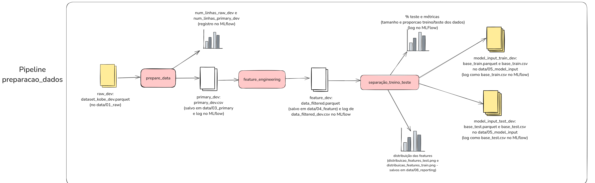

- Pipeline de treinamento dos modelos:

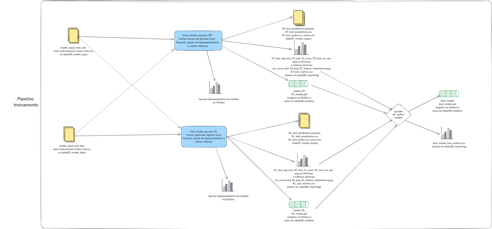

- Pipeline de aplicação dos modelos aos dados de produção:

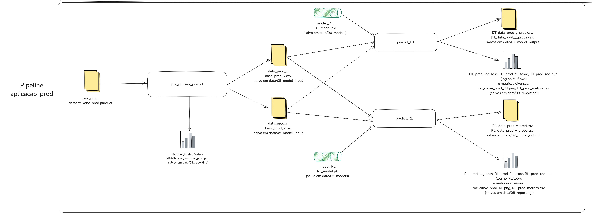

Além disso, após a execução do projeto, o melhor modelo foi servido em uma API via MLflow, e chamado dentro do Streamlit, conforme o diagrama a seguir:
- Servindo o melhor modelo via MLflow e monitorando via Streamlit

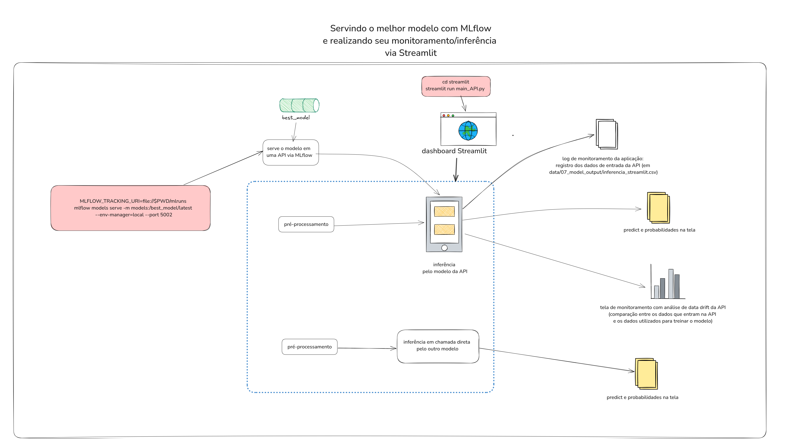

## Item 3.
#### Como as ferramentas Streamlit, MLFlow, PyCaret e Scikit-Learn auxiliam na construção dos pipelines descritos anteriormente?

##### MLFlow
	
- Por meio do MLFlow, é possível realizar o **rastreamento** e **monitoramento** de métricas, artefatos e modelos diversos do experimento. Assim, a cada execução da aplicação, ele registrará os dados que por ele estiverem monitorados, e manterá um versionamento, o que possibilita a consulta, análise e comparação futura. 
- Com ele, é possível também realizar o **registro, versionamento e serviço** de modelos que treinamos e personalizamos na aplicação. Esse serviço pode ser de forma local (no caso que foi feito neste trabalho) ou para um servidor central. Ao permitir exportar modelos para outras plataformas, ele tem assim também um **papel importante no processo de provisionamento/deployment** dessa aplicação.
- O MLflow permite ainda a **atualização de modelos**, tendo em vista que por ele é possível rastrear versões anteriores e diferentes de um modelo e promovê-lo para ser utilizado em produção.
- No nosso caso, utilizamos o MLflow tanto para logar métricas, parâmetros e artefatos diversos, versionando-os, quanto para servir o modelo e chamá-lo no Streamlit.

##### PyCaret

- O Pycaret é uma ferramenta de AutoML, ou seja, tem o intuito de facilitar o processo de desenvolvimento de Machine Learning por meio de diversos recursos pré-definidos. Tais recursos auxiliam na tarefa de **treinamento** de modelos (verificar qual o melhor modelo, realizar o ajuste de hiperparâmetros, coletar métricas diversas que auxiliam na comparação de modelos, entre outros).
- Dessa forma, o Pycaret pode estar intimamente ligado às funções de treinamento de um modelo de Machine Learning, e de certa forma também de **atualização** de modelo (na medida em que permite verificarmos suas métricas de desempenho e retreinarmos o modelo com facilidade, sempre que necessário).
- No caso deste projeto, o Pycaret foi utilizado para treinar e auxiliar a encontrar o melhor modelo tanto de Regressão Logística quanto de Árvore de Decisão, além de coletar métricas, que foram armazenadas no projeto.

##### Scikit-Learn

- O Scikit-Learn tem muitas ferramentas úteis e importantes para a análise e pré-processamento de dados, **treinamento** de modelos, predição do resultado e das probabilidades. É particularmente útil quando estamos no cenário em que não temos mais o experimento do Pycaret, mas ainda assim precisamos realizar as **predições** com um modelo previamente salvo (por exemplo, tenho dados novos e um modelo salvo e preciso realizar predições com esses dados).
- O Scikit-Learn também é muito útil na coleta de métricas, na medida em que os resultados das predições por ele realizadas permitem a análise da performance do modelo.


##### Streamlit

- O Streamlit permite o **monitoramento da saúde** da aplicação, bem como fornece uma interface gráfica que favorece a interação do usuário e a análise desse monitoramento.
- Como fornece uma interface gráfica para uso, o Streamlit pode ainda ser parte importante do **provisionamento/deployment** de uma aplicação.
- No caso deste projeto, após encontrar o melhor modelo, ele foi servido via MLflow e em seguida chamado no Streamlit, onde foi possível: realizar a inferência dos dados e monitorar os dados que entram na aplicação em cada requisição, bem como compará-los com os dados de treinamento. Esse monitoramento dos dados de produção pode auxiliar na detecção de **data drift**, ou **feature drift**, e auxilia portanto a manter a saúde do modelo.

## Item 4.
#### Artefatos criados ao longo do projeto e sua descrição:
 - Em data/01_raw:
   - **dataset_kobe_dev.parquet**: dataset original com os dados iniciais (features e targets) de desenvolvimento no formato parquet;
   - **dataset_kobe_prod.parquet**: dataset original com os dados iniciais (features e targets) de produção no formato parquet;
   --------------   
 - Em data/03_primary:
   - **primary_dev.csv**: dataset com os dados de desenvolvimento após tratamento inicial dos dados (remoção de duplicatas, seleção das features que serão utilizadas no projeto, retirada de dados nulos e transformação de playoffs em booleano) em formato csv;
   --------------
 - Em data/04_feature:
   - **data_filtered.parquet**: dataset com os dados de desenvolvimento após feature engineering (transformação de latitude e longitude em dados com maior informação para o modelo - posição na quadra - representados por lat_quadra e lon_quadra) em formato parquet;
   - **data_filtered_dev.csv**: dataset com os dados de desenvolvimento após feature engineering (transformação de latitude e longitude em dados com maior informação para o modelo - posição na quadra - representados por lat_quadra e lon_quadra) em formato csv;
   --------------
 - Em data/05_model_input:
   - **base_prod_x.csv**: dataset com os dados das features de produção tratados e prontos para entrada no modelo, em formato csv;
   - **base_prod_y.csv**: dataset com os dados dos targets de produção tratados e prontos para entrada no modelo, em formato csv;
   - **base_test.csv**: dataset com os dados de features e targets de teste tratados e prontos para entrada no modelo, em formato csv (dados obtidos após a separação treino e teste de data_filtered.parquet);
   - **base_test.parquet**: dataset com os dados de features e targets de teste tratados e prontos para entrada no modelo, em formato parquet (dados obtidos após a separação treino e teste de data_filtered.parquet);
   - **base_train.csv**: dataset com os dados de features e targets de treino tratados e prontos para entrada no modelo, em formato csv (dados obtidos após a separação treino e teste de data_filtered.parquet);
   - **base_train.parquet**: dataset com os dados de features e targets de treino tratados e prontos para entrada no modelo, em formato parquet (dados obtidos após a separação treino e teste de data_filtered.parquet);
   --------------
 - Em data/06_models:
   - **best_model.pkl**: melhor modelo escolhido (entre Regressão Logística e Árvore de Decisão) em formato pickle, após treino, tunning de hiperparâmetros, validação e comparação entre modelos;
   - **DT_model.pkl**: melhor modelo de Árvore de Decisão encontrado em formato pickle, após treino, tunning de hiperparâmetros e validação;
   - **RL_model.pkl**: melhor modelo de Regressão Logística encontrado em formato pickle, após treino, tunning de hiperparâmetros e validação;
   --------------
 - Em data/07_model_output:
   - **DT_data_prod_y_pred.csv**: resultado do predict (se acertou a cesta ou não) dos dados de produção pelo modelo de Árvore de Decisão (DT_model.pkl) em formato csv;
   - **DT_data_prod_y_pred.parquet**: resultado do predict (se acertou a cesta ou não) dos dados de produção pelo modelo de Árvore de Decisão (DT_model.pkl) em formato parquet;
   - **DT_data_prod_y_proba.csv**: resultado do predict_proba (probabilidades de acerto) dos dados de produção pelo modelo de Árvore de Decisão (DT_model.pkl) em formato csv;
   - **DT_data_prod_y_proba.parquet**: resultado do predict_proba (probabilidades de acerto) dos dados de produção pelo modelo de Árvore de Decisão (DT_model.pkl) em formato parquet;
   - **DT_test_predictions.csv**: resultado do predict (se acertou a cesta ou não) dos dados de teste pelo modelo de Árvore de Decisão (DT_model.pkl) em formato csv;
   - **DT_test_predictions.parquet**: resultado do predict (se acertou a cesta ou não) dos dados de teste pelo modelo de Árvore de Decisão (DT_model.pkl) em formato parquet;
   - **DT_test_probs.csv**: resultado do predict_proba (probabilidades de acerto) dos dados de teste pelo modelo de Árvore de Decisão (DT_model.pkl) em formato csv;
   - **inferencia_streamlit.csv**: log dos dados enviados para a API que serve o modelo; contém um histórico dos dados contidos nas requisições feitas, útil para monitoramento dos dados de produção.
   - **RL_data_prod_y_pred.csv**: resultado do predict (se acertou a cesta ou não) dos dados de produção pelo modelo de Regressão Logística (RL_model.pkl) em formato csv;
   - **RL_data_prod_y_pred.parquet**: resultado do predict (se acertou a cesta ou não) dos dados de produção pelo modelo de Regressão Logística (RL_model.pkl) em formato parquet;
   - **RL_data_prod_y_proba.csv**: resultado do predict_proba (probabilidades de acerto) dos dados de produção pelo modelo de Regressão Logística (RL_model.pkl) em formato csv;
   - **RL_data_prod_y_proba.parquet**: resultado do predict_proba (probabilidades de acerto) dos dados de produção pelo modelo de Regressão Logística (RL_model.pkl) em formato parquet;
   - **RL_test_predictions.csv**: resultado do predict (se acertou a cesta ou não) dos dados de teste pelo modelo de Regressão Logística (RL_model.pkl) em formato csv;
   - **RL_test_predictions.parquet**: resultado do predict (se acertou a cesta ou não) dos dados de teste pelo modelo de Regressão Logística (RL_model.pkl) em formato parquet;
   - **RL_test_probs.csv**: resultado do predict_proba (probabilidades de acerto) dos dados de teste pelo modelo de Regressão Logística (RL_model.pkl) em formato csv;
   --------------
 - Em data/08_reporting:
   - **best_model_test_metrics.csv**: métricas do melhor modelo (best_model.pkl) após validação com os dados de teste - Acurácia,AUC,Recall,Precisão,F1,Kappa,MCC,roc_auc (área sob a curva ROC),test_log_loss (log loss medido com os dados de teste),test_f1 (F1 Score medido com os dados de teste);
   - **distribuicao_features_prod.png**: gráficos que mostram a distribuição das features dos dados de produção plotada por meio de violinplot;
   - **distribuicao_features_test.png**: gráficos que mostram a distribuição das features dos dados de teste plotada por meio de violinplot;
   - **distribuicao_features_train.png**: gráficos que mostram a distribuição das features dos dados de treino plotada por meio de violinplot;
   - **DT_feature_importance.png**: gráfico que mostra o grau de importância das features para predição pelo modelo de Árvore de Decisão (DT_model.pkl);
   - **DT_prod_metrics.csv**: métricas da predição dos dados de produção pelo modelo de Árvore de Decisão (DT_model.pkl)  - Acurácia,AUC,Recall,Precisão,F1 Score e Log Loss;
   - **DT_test_metrics.csv**: métricas do modelo de Árvore de Decisão (DT_model.pkl) após validação com os dados de teste - Acurácia,AUC,Recall,Precisão,F1,Kappa,MCC,roc_auc (área sob a curva ROC),test_log_loss (log loss medido com os dados de teste),test_f1 (F1 Score medido com os dados de teste);
   - **RL_feature_importance.png**: gráfico que mostra o grau de importância das features para predição pelo modelo de Regressão Logística (RL_model.pkl);
   - **RL_prod_metrics.csv**: métricas da predição dos dados de produção pelo modelo de Regressão Logística (RL_model.pkl) - Acurácia,AUC,Recall,Precisão,F1 Score e Log Loss;
   - **RL_test_metrics.csv**: métricas do modelo de Regressão Logística (RL_model.pkl) após validação com os dados de teste - Acurácia,AUC,Recall,Precisão,F1,Kappa,MCC,roc_auc (área sob a curva ROC),test_log_loss (log loss medido com os dados de teste),test_f1 (F1 Score medido com os dados de teste);
   - **roc_curve_prod_DT.png**: gráfico que mostra a curva ROC do modelo de Árvore de Decisão (DT_model.pkl) em relação aos dados de produção;
   - **roc_curve_prod_RL.png**: gráfico que mostra a curva ROC do modelo de Regressão Logística (RL_model.pkl) em relação aos dados de produção;
   - **roc_curve_test_DT.png**: gráfico que mostra a curva ROC do modelo de Árvore de Decisão (DT_model.pkl) em relação aos dados de teste;
   - **roc_curve_test_RL.png**: gráfico que mostra a curva ROC do modelo de Regressão Logística (RL_model.pkl) em relação aos dados de teste.

## Item 5.
#### Pipeline de processamento de dados

A pipeline de processamento de dados se chama preparacao_dados.

**a**. Os dados iniciais estão armazenados em data/01_raw, com o nome de dataset_kobe_dev.parquet e dataset_kobe_prod.parquet.
**b**. As linhas duplicadas foram removidas, as linhas com dados faltantes foram desconsideradas, conforme solicitado, e foram consideradas apenas as colunas lat, lon, minutes remaining, period, playoffs, shot_distance, conforme solicitado. Os dados resultantes estão em data/03_primary, no arquivo primary_dev.csv.
 Em seguida, as colunas lat e lon foram transformadas a fim de extrair dados mais úteis para a predição: a partir delas foram obtidas as colunas lat_quadra e lon_quadra. Os dados resultantes estão em data/04_feature, no arquivo data_filtered.parquet.
 A dimensão resultante do data_filtered.parquet é de 20285 linhas e 7 colunas, como é possível verificar nas métricas do mlflow:

 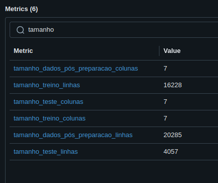

Na última etapa do pré-processamento, os dados foram separados em treino (80%) e teste (20%), de forma aleatória e estratificada. Pela imagem acima também é possível ver o tamanho do dataset de treino (16228 linhas e 7 colunas) e do dataset de teste (4057 linhas e 7 colunas). Para fazer essa divisão, foi utilizada a função train_test_split do sklearn.model_selection, conforme abaixo:

```python
x_data_train, x_data_test, y_data_train, y_data_test = train_test_split(x_data, y_data, test_size=test_size,
    random_state=random_state_param, stratify=y_data)
```
No caso, os dados de x_data e y_data são as features e o target de data_filtered.parquet, respectivamente. O random_state e o test_size estão configurados em conf/base/parameters.yml, e são respectivamente 3128 e 0,2.
A imagem a seguir, com métricas do MLflow, mostra como ficou a proporção treino teste:

 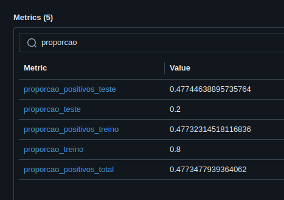

Após a separação em treino e teste, os datasets de treino e teste foram armazenados em data/05_model_input como base_train.parquet e base_test.parquet, respectivamente.

A escolha de treino e teste precisa ser bem feita e pode afetar no resultado final na medida em que, se o dataset de treino não é representativo dos dados de inferência (teste ou produção), o modelo treinado pode ficar bem ajustado a um tipo específico de dado, mas não a outro. Isso pode facilitar a ocorrência do problema de overfitting, que é quando meu modelo se ajusta bem e performa bem para os dados de treino, e performa mal para os dados de teste, por deixar o modelo enviesado para um tipo específico de dado. Ou ainda, se eu tenho predominância de um tipo de target para treino e predominância de outro para teste, o meu resultado de acurácia pode estar enviesado para um target específico.

 Dessa forma, algumas estratégias para evitar esse problema são: **a divisão entre treino e teste de forma estratificada** - dessa forma, a proporção entre os targets permanecerá entre os grupos de treino e teste - ; e ainda, **a validação cruzada** durante a fase de treinamento - por treinar e validar em diferentes configurações, a validação cruzada ajuda a reduzir o impacto de eventuais divisões enviesadas.

## Item 6.
#### Pipeline de treinamento

A pipeline de treinamento do projeto se chama treinamento.

A partir dos dados separados para treinamento na pipeline de preparação dos dados, foi treinado um modelo de regressão logística (RL) e um modelo de árvore de decisão (DT) do sklearn usando a biblioteca pyCaret. Tais modelos estão salvos como artefatos do projeto(em data/06_models), e são monitorados pelo MLflow e registrados com os nomes de RL_model.pkl e DT_model.pkl, respectivamente. 

Além disso, os modelos foram comparados entre si e foi escolhido o melhor modelo dentro da pipeline de treinamento, no nó de nome compare_models_node, que chama a função compare_models. Para a escolha do melhor modelo, foi utilizada a medida da área sob a curva ROC, ou **auc roc** (o modelo com a maior medida de **auc roc** foi considerado com melhor performance geral). Esse melhor modelo foi salvo como artefato do projeto (em data/06_models), com o nome de best_model.pkl, e também é rastreado pelo MLflow. 

Por fim, uma versão desse modelo foi registrada no MLflow para ter como saída o predict_proba, a fim de que a API com esse modelo, ao ser chamada, retorne as probabilidades de acerto ou de erro da cesta.

As imagems a seguir mostram os modelos rastreados no MLflow, bem como os melhores hiperparâmetros encontrados para cada:

 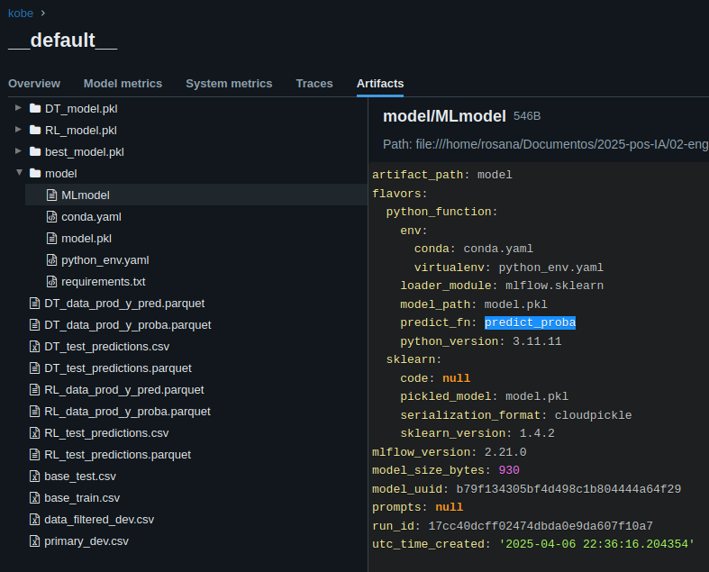

Hiperparâmetros encontrados para a árvore de decisão após o tunning:

 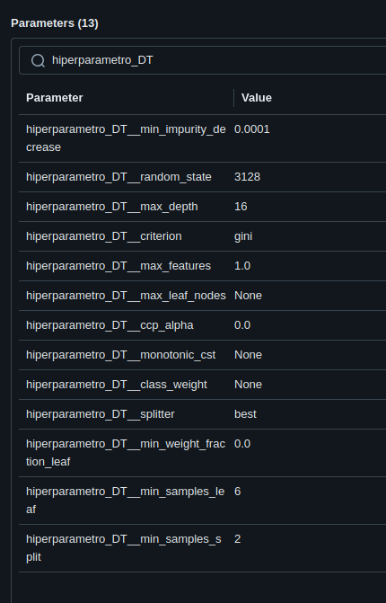

Hiperparâmetros encontrados para a regressão logística após o tunning:

 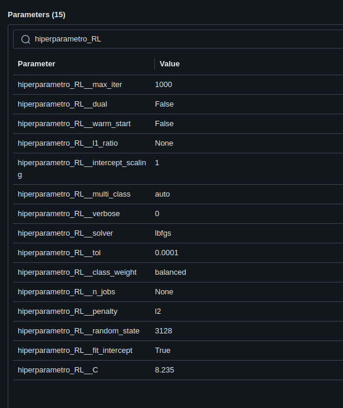

As métricas de log_loss, F1_score com os dados de teste para os modelos de árvore de decisão e de regressão logística foram logadas no MLflow:

 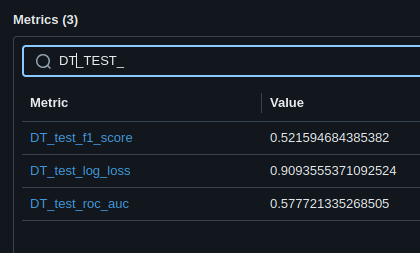

 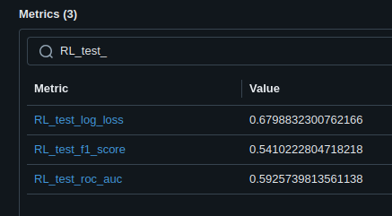

As métricas mais completas de teste para os modelos de árvore de decisão e de regressão logística se encontram salvas nos artefatos (em data/08_reporting) com os nomes de DT_test_metrics.csv e RL_test_metrics.csv, respectivamente.

É possível verificar que nenhum dos dois modelos teve uma boa performance, mas a regressão logística performou um pouco melhor (F1 Score de 0.54 contra 0.52 da árvore de decisão; e roc auc de 0.59, contra aproximadamente 0.58 da árvore de decisão). Assim, esse modelo demonstrou ser o melhor entre os dois dentro deste projeto. 

Se quisermos analisar a importância observada pelos modelos para cada feature na previsão de acerto ou erro, dentre as features utilizadas, podemos consultar os artefatos salvos em data/08_reporting, com os nomes de RL_feature_importance.png e DT_feature_importance.png. Por elas, podemos verificar que, para o modelo de RL encontrado, a lat_quadra (feature originada da latitude) demonstrou ser o melhor indicador de acerto ou erro, enquanto na DT, as features de shot_distance, lon_quadra e lat_quadra demonstraram ser os melhores indicadores. 

Importância das features no modelo de árvore de decisão:
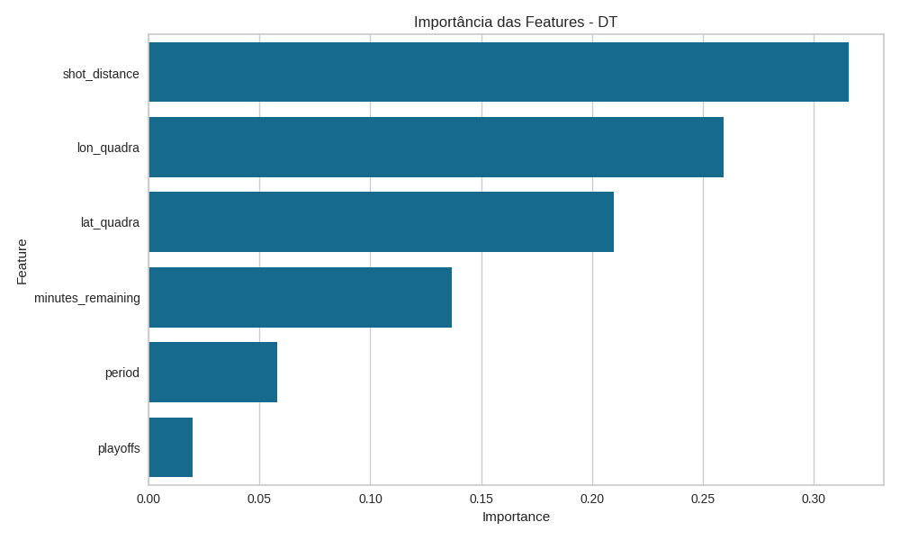

Importância das features no modelo de regressão logística:
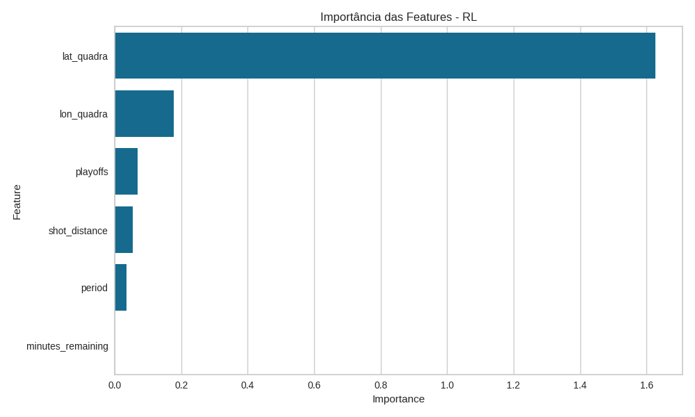

No entanto, de modo geral, a performance desses dois modelos não esteve muito boa, como vimos nas métricas acima. As possíveis explicações para essa performance são que as features utilizadas neste projeto não são bons indicadores de acerto ou erro de cesta. Uma alternativa no caso real, se quiséssemos melhorar a performance do projeto, seria testar a utilização de outras features do dataset original.


Podemos ainda verificar as curvas roc de ambos os modelos para os dados de teste, as quais se encontram salvas nos artefatos em data/08_reporting, com os nomes de roc_curve_test_DT.png e roc_curve_test_RL.png

## Item 7.
#### Pipeline de aplicação

A pipeline de treinamento do projeto se chama aplicacao_prod.

A pipeline de aplicação, que é a última pipeline do projeto, é responsável por carregar os dados de produção (que estão em data/01_raw/dataset_kobe_prod.parquet), pré-processá-los e realizar a inferência de seus dados por meio dos modelos obtidos na pipeline anterior, de treinamento.

Os resultados obtidos (tanto a previsão de acerto ou erro quanto as probabilidades de cada) estão salvos em data/07_model_output, e também estão logados no MLflow, como DT_data_prod_y_proba.parquet, DT_data_prod_y_pred.parquet, RL_data_prod_y_proba.parquet e RL_data_prod_y_pred.parquet.

Os resultados também estão disponíveis como csv em data/07_model_output.

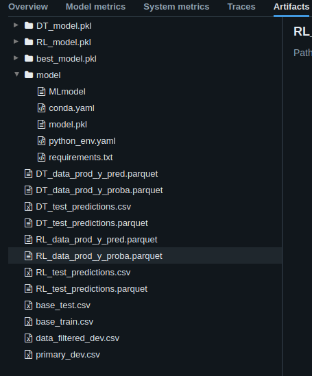

As métricas da inferência estão salvas em data/08_reporting como DT_prod_metrics.csv e RL_prod_metrics.csv. O F1 Score, o log loss e o roc auc (área sob a curva ROC) de produção também estão logados no MLflow, tanto para a árvore de decisão quanto para a regressão logística:

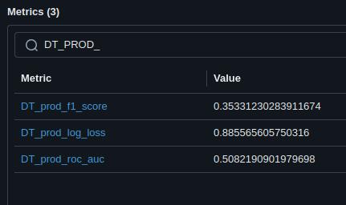

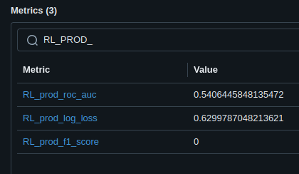

As curvas roc da inferência de produção também podem ser encontradas em data/08_reporting, como roc_curve_prod_DT.png e roc_curve_prod_RL.png.

Dos resultados obtidos, é possível perceber que a aderência dos modelos treinados a essa nova base foi **muito baixa** (F1 Score de 0,35 para a árvore de decisão, e F1 Score de 0 para a regressão logística). 
No caso da regressão logística, o F1 Score foi ainda mais baixo, e quase todos os predicts da sua inferência foram iguais a 0. 

Distribuição das features de treino:
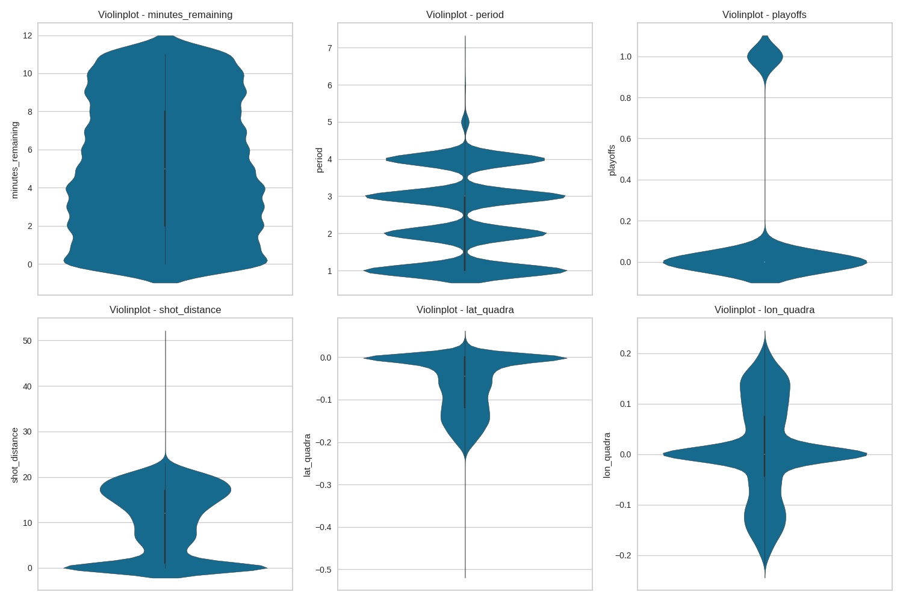

Distribuição das features de produção:
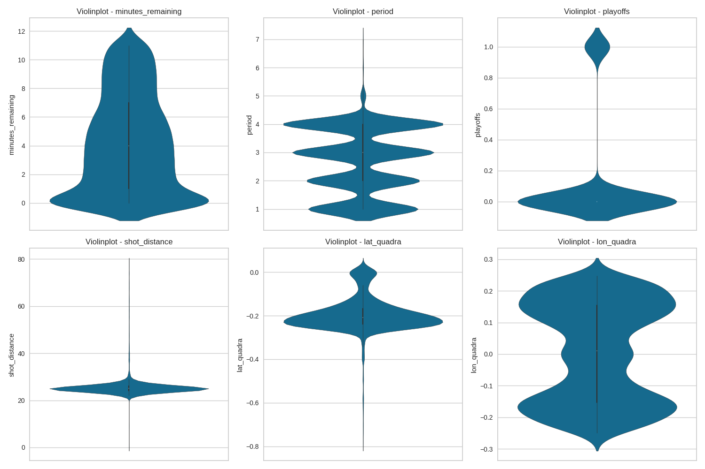

Observando as distribuições acima, é possível ver que há uma grande diferença entre a lat_quadra dos dados de produção (com boa parte abaixo de -0.15), e o lat_quadra dos dados de desenvolvimento (com boa parte acima desse valor). Assim, pode-se perceber que os dados de produção são diferentes dos utilizados para treino dos modelos, e como consequência a adesão dos modelos a esses dados novos foi muito baixa.
Analisando mais cuidadosamente, podemos perceber que esse resultado ainda pior da regressão logística está de acordo com a importância das features percebida pelo modelo de regressão logística, conforme já mencionado no item 6 acima. Isso porque o modelo de regressão logística percebeu grande importância na feature de lat_quadra. Todavia, como já vimos, se analisarmos a distribuição das features dos dados de produção, podemos perceber que a latitude, que dá origem à lat_quadra, está bem diferente nos dados de produção em relação aos dados de desenvolvimento.

Por fim, após subir o MLflow e rodar o projeto com kedro run, o comando utilizado para servir o modelo, como explicado no item 1.4 acima, foi:
```bash
# dentro da env, no diretório kobe/
MLFLOW_TRACKING_URI=file://$PWD/mlruns mlflow models serve -m models:/best_model/latest --env-manager=local --port 5002
```

Neste projeto, conseguimos perceber então que uma forma de monitorar a saúde do modelo no cenário em que temos disponível a variável de resposta seria por meio do cálculo das métricas (F1 Score, Log loss, roc auc, recall, precisão, entre outras), e de sua comparação com as métricas obtidas com os dados de teste à época em que foi realizado o treinamento do modelo. Quando temos o target real, o cálculo dessas métricas se torna possível, e a análise da qualidade e da adesão do modelo aos dados de produção se torna mais facilitada.
Isso pode ser feito por meio do log dos dados de entrada no modelo para inferência, bem como de seu target esperado, e posterior cálculo das métricas a partir dos dados registrados.

Todavia, se não temos essas variáveis de resposta, uma alternativa, também explorada neste projeto, conforme demonstrado acima, é a análise das features, e se elas têm mudado muito em relação aos dados utilizados para treinamento. Por meio da análise da distribuição das features podemos ver se os dados novos são muito diferentes em relação aos dados de treino, e analisar possibilidades como *data drift* ou *feature drift*, que exijam um retreinamento do modelo.

Podemos então adotar estratégias reativa ou preditiva para o modelo em operação: No caso da preditiva, podemos monitorar as mudanças nas features de entrada, e sempre que notarmos mudanças significativas, realizar o retreinamento do modelo; no caso da estratégia reativa, podemos observar o comportamento de métricas, e retreinar o modelo sempre que as métricas estiverem fora de um intervalo esperado.


## Item 8.
#### Dashboard de monitoramento da operação usando Streamlit

Após servir o modelo, podemos subir o Streamlit conforme o comando do item 1.5 acima:

```bash
# dentro da env, no diretório kobe/
cd streamlit
streamlit run main_API.py 
```

Após executar tal comando, podemos acessar a porta 8501 da nossa máquina no navegador para acessar a interface do Streamlit.

Pelo Streamlit, podemos **fazer consultas à API** e realizar a inferência a partir de dados passados pelo usuário.

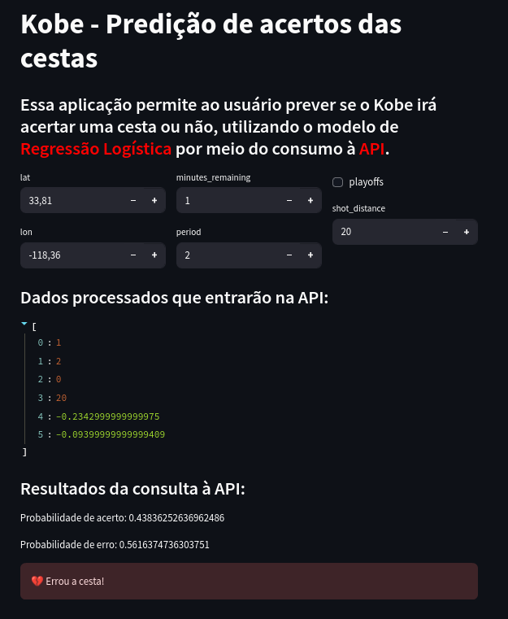

Após realizar a consulta, o Streamlit também mostrará um comparativo entre as features do dado consultado em relação aos dados de treinamento:

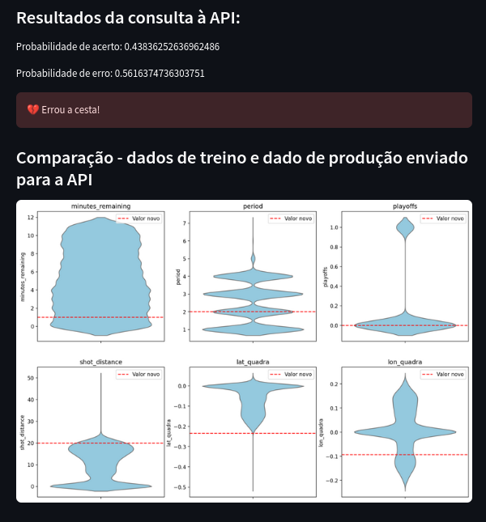

Assim, é possível monitorar se as features consultadas estão de acordo com o dataset de treino, ou se os dados estão muito diferentes. Esse monitoramento pode ser útil na análise de necessidade de retreinamento do modelo.

Além disso, no Streamlit foi criada uma aba que permite o monitoramento das features de todas as requisições feitas à API pelo Streamlit. Para isso, primeiro foi feito o log das features dessas requisições, e esse log está salvo em data/07_model_output/inferencia_streamlit.csv. **Sempre que forem feitas novas requisições à API via Streamlit, os dados das features da requisição serão salvos nesse log**. Em seguida, para a aba de monitoramento, é feito o plot dos dados dessas novas requisições, em comparação aos dados das features utilizadas no treinamento. Dessa forma é possível fazer uma análise de eventual *data drift* ou *feature drift* no modelo.

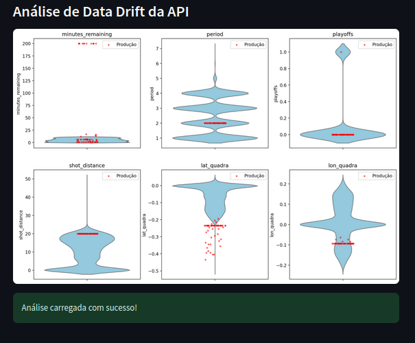

Por fim, ainda no Streamlit, foi disponibilizada uma página que permite a inferência do acerto ou não da cesta pelo modelo de árvore de decisão, mas sem a utilização da API para realizar a chamada.

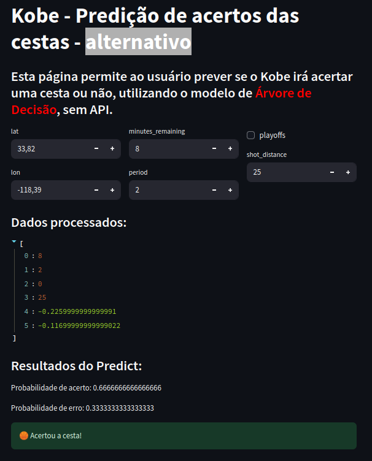

## Arquivos e Diretórios Importantes


- `data/`: Diretório para armazenar artefatos do projeto
- `mlruns/`: Diretório para armazenar métricas, parâmetros, modelos e artefatos que foram rastreados pelo MLflow
- `conf/local/mlflow.yml`: Configuração do MLflow 
- `conf/base/`: Diretório com catálogo e parâmetros utilizados no projeto
- `docs/`: Diretório contendo diagramas do projeto e prints de registros do MLflow
- `src/`: Diretório com o código-fonte do projeto
- `notebooks/`: Diretório com notebooks utilizados na etapa de análise e desenvolvimento do projeto
- `streamlit/`: Diretório com os arquivos do Streamlit
(...)

--------


