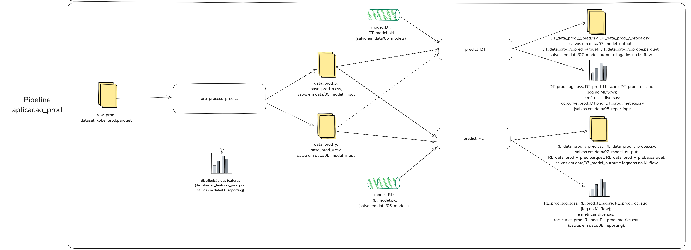

## PD - Projeto da Disciplina - Engenharia de Machine Learning [25E1_3]
#### Aluna: Rosana Ribeiro Lima


## Item 1.
Link para o projeto no Github: 
https://github.com/roriblim/kobe-PD

## Item 2.
#### Diagramas com as etapas do projeto:
- Pipeline de preparação dos dados:


- Pipeline de treinamento dos modelos


- Pipeline de aplicação dos modelos aos dados de produção



- Servindo o melhor modelo via MLflow e monitorando via Streamlit


## Item 3.
#### Como as ferramentas Streamlit, MLFlow, PyCaret e Scikit-Learn auxiliam na construção dos pipelines descritos anteriormente?

##### MLFlow
	
- Por meio do MLFlow, é possível realizar o **rastreamento** e **monitoramento** de métricas, artefatos e modelos diversos do experimento. Assim, a cada execução da aplicação, ele registrará os dados que por ele estiverem monitorados, e manterá um versionamento, o que possibilita a consulta, análise e comparação futura. 
- Com ele, é possível também realizar o **registro, versionamento e serviço** de modelos que treinamos e personalizamos na aplicação. Esse serviço pode ser de forma local (no caso que foi feito neste trabalho) ou para um servidor central. Ao permitir exportar modelos para outras plataformas, ele tem assim também um **papel importante no processo de provisionamento/deployment** dessa aplicação.
- O MLflow permite ainda a **atualização de modelos**, tendo em vista que por ele é possível rastrear versões anteriores e diferentes de um modelo e promovê-lo para ser utilizado em produção.
- No nosso caso, utilizamos o MLflow tanto para logar métricas, parâmetros e artefatos diversos, versionando-os, quanto para servir o modelo e chamá-lo no Streamlit.

##### PyCaret

- O Pycaret é uma ferramenta de AutoML, ou seja, tem o intuito de facilitar o processo de desenvolvimento de Machine Learning por meio de diversos recursos pré-definidos. Tais recursos auxiliam na tarefa de **treinamento** de modelos (verificar qual o melhor modelo, realizar o ajuste de hiperparâmetros, coletar métricas diversas que auxiliam na comparação de modelos, entre outros).
- Dessa forma, o Pycaret pode estar intimamente ligado às funções de treinamento de um modelo de Machine Learning, e de certa forma também de **atualização** de modelo (na medida em que permite verificarmos suas métricas de desempenho e retreinarmos o modelo com facilidade, sempre que necessário).
- No caso deste projeto, o Pycaret foi utilizado para treinar e auxiliar a encontrar o melhor modelo tanto de Regressão Logística quanto de Árvore de Decisão, além de coletar métricas, que foram armazenadas no projeto.

##### Scikit-Learn

- O Scikit-Learn tem muitas ferramentas úteis e importantes para a análise e pré-processamento de dados, **treinamento** de modelos, predição do resultado e das probabilidades. É particularmente útil quando estamos no cenário em que não temos mais o experimento do Pycaret, mas ainda assim precisamos realizar as **predições** com um modelo previamente salvo (por exemplo, tenho dados novos e um modelo salvo e preciso realizar predições com esses dados).
- O Scikit-Learn também é muito útil na coleta de métricas, na medida em que os resultados das predições por ele realizadas permitem a análise da performance do modelo.


##### Streamlit

- O Streamlit permite o **monitoramento da saúde** da aplicação, bem como fornece uma interface gráfica que favorece a interação do usuário e a análise desse monitoramento.
- Como fornece uma interface gráfica para uso, o Streamlit pode ainda ser parte importante do **provisionamento/deployment** de uma aplicação.
- No caso deste projeto, após encontrar o melhor modelo, ele foi servido via MLflow e em seguida chamado no Streamlit, onde foi possível: realizar a inferência dos dados e monitorar os dados que entram na aplicação em cada requisição, bem como compará-los com os dados de treinamento. Esse monitoramento dos dados de produção pode auxiliar na detecção de **data drift**, ou **feature drift**, e auxilia portanto a manter a saúde do modelo.

## Overview

Para rodar este projeto, foi criado um ambiente com Python na versão 3.11


## Arquivos e Diretórios Importantes


- `mlruns/`: Diretório para armazenar artefatos do MLflow
- `conf/local/mlflow.yml`: Configuração do MLflow 

(...)


## Executando de forma local 

### Pré-requisitos

- Python 3.11
- pip (gerenciador de pacotes Python)

### 1. Configuração do ambiente

1. Crie um ambiente virtual com Python 3.11 (recomendado):
Exemplo:
```bash
conda create --name PD_env_1 python=3.11 --no-default-packages -y
conda activate PD_env_1 # sempre que for necessário entrar na env para executar comandos no projeto!
```

2. Instale as dependências:

```bash
# dentro da env, no diretório kobe/
pip install -r requirements.txt
```

### 2. Visualizando experimentos com MLflow

Para iniciar o servidor MLflow localmente, o qual será responsável por rastrear modelos e algumas métricas e parâmetros no projeto:

```bash
# dentro da env, no diretório kobe/
mlflow server --host 0.0.0.0 --port 5000
```

### 3. Executando o projeto

Após iniciar o servidor MLflow localmente, para executar as pipelines Kedro (pré-processamentos, gerar as métricas, modelos e resultados, e inferências com os dados de produção), execute o projeto com:

```bash
# dentro da env, no diretório kobe/
kedro run
```

### 4. Servindo o modelo gerado com MLflow

É possível subir o melhor modelo encontrado com o seguinte comando:

```bash
# dentro da env, no diretório kobe/
MLFLOW_TRACKING_URI=file://$PWD/mlruns mlflow models serve -m models:/best_model/latest --env-manager=local --port 5002
```

### 5. Monitorando API com Streamlit (fazendo inferências)

**Após servir o modelo com MLflow**, é possível monitorá-lo via Streamlot com o seguinte comando:

```bash
# dentro da env, no diretório kobe/
cd streamlit
streamlit run main_API.py 
```

### JupyterLab

O projeto inclui ainda suporte para JupyterLab. Para usar o JupyterLab:

```bash
# dentro da env, no diretório kobe/
kedro jupyter lab --no-browser
```


